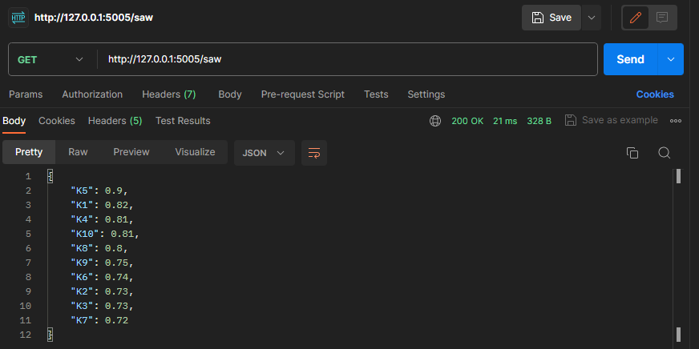
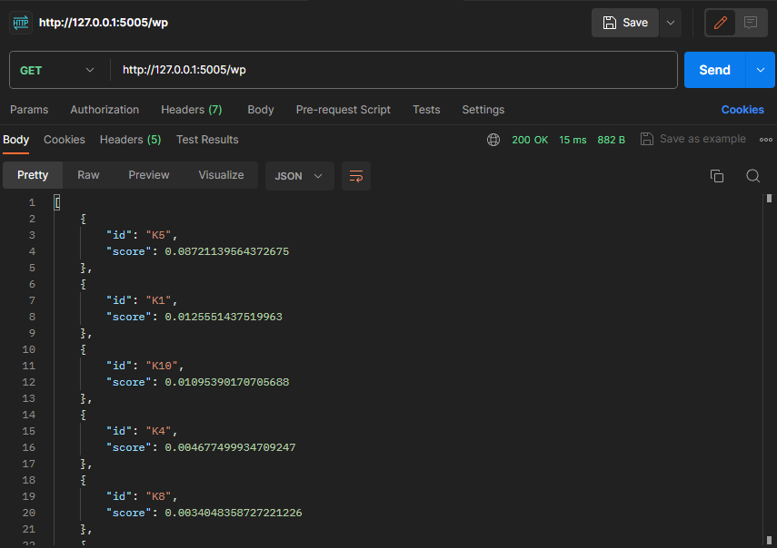
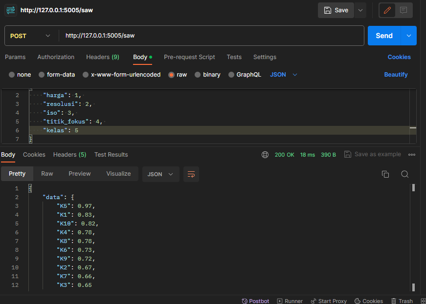
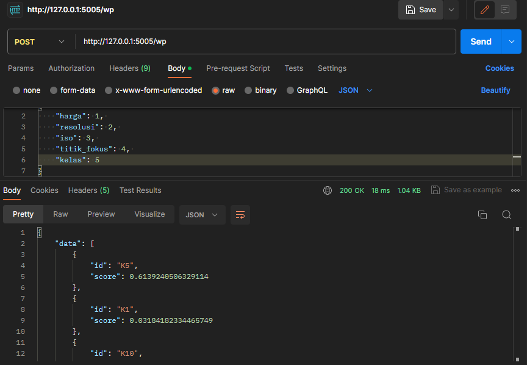

# UAS spk_web

## Install venv

    virtualenv venv

## Install requirements

    pip install -r requirements.txt

## Run the app
to run the web app simply  use

    python main.py

## Usage
Install postman 
https://www.postman.com/downloads/

get kamera list

get recommendations saw

get recommendations wp

### TUGAS UAS
Implementasikan model yang sudah anda buat ke dalam web api dengan http method `POST`

INPUT:
{
    "harga": 1, 
    "resolusi": 2, 
    "iso": 3, 
    "titik_fokus": 4, 
    "kelas": 5
}

OUTPUT (diurutkan / sort dari yang terbesar ke yang terkecil):

post recommendations saw

post recommendations wp

